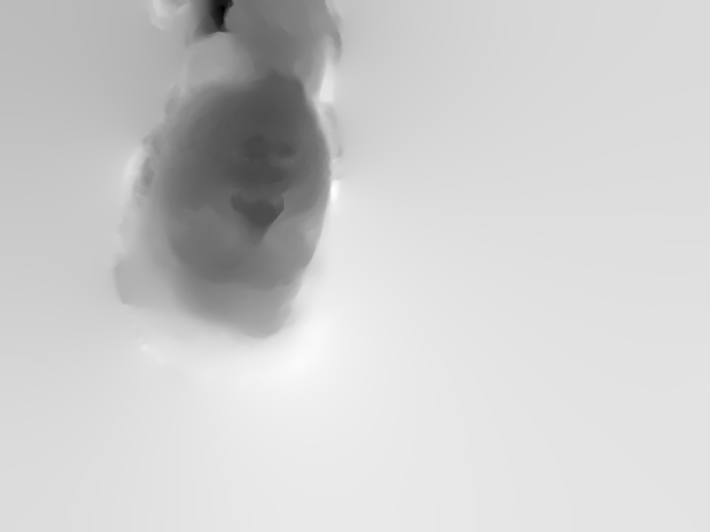

# Overview

This repository contains the code and data for the paper:

* Birkbeck, N., Cobzas, D., Jagersand, M. *Depth and Scene Flow from a Single Moving Camera*. International Symposium on 3D Data Processing, Visualization and Transmission (3DPVT) 2010. ([preprint](https://webdocs.cs.ualberta.ca/~dana/Papers/10_3dpvt_Birkbeck.pdf))

Much of the code for our ICCV 2011 paper:

* N. Birkbeck, D. Cobzaş and M. Jägersand, *Basis constrained 3D scene flow on a dynamic proxy,* 2011 International Conference on Computer Vision, Barcelona, 2011, pp. 1967-1974 (https://ieeexplore.ieee.org/document/6126467).

also lives in this repository.


## Directory structure

This repository is organized as follows:

```
monoflow
| README.md      [This file]
└-src
|  └contdepth:   Main programs and scripts for the paper
|  └ik:          helper library for meshes/kinematics
|  └autorecon:   helper library for computer vision / geometry
|  | └stereo:    basic scene-flow and multi-grid solvers
|  └utigl:       OpenGL utilities, fonts, windows, etc
|  └packages
|    └[tar.gz and third_party deps that must be installed]
└-monoflow-data
   └kpop:        Human face data set. Figures 9/10 in paper
   └armhouse5:   House and shirt dataset. Figures 7/8 in paper
   └plane_moving_camera: Dataset for Figure 4/Figure 5.
   └plane_simple: Simple plane dataset(not in paper)
   └rsphererend:  Rotating sphere dataset (not in paper)    
```

The data can be downloaded from neilbirkbeck.com/files/monoflow-data.tar.gz.

## Input data format

Each of the directories in the data directory correspond to a single capture.

Each folder will have a `seq` directory that should have several numeric
subdirectories (e.g., seq/0, seq/1, seq/2, etc.). Each of those will have a single
image-0000.tga (or .png file) and a calib.clb file. 

The `calib.clb` file is the camera calibration in a riff form. The calibration file
generally will have two entries, a 3x3 intrinsics matrix ${\bf K}$, and a 4x4
extrinsics matrix ${\bf E}$. Both of these are stored as row-major doubles. 
The camera calibration file may also have distortion parameters, however
it is assumed that all the data in seq/* have been rectified.

The data folders will likely also contain a `dist` and `undist` directory that will
contain the image sequence before/after distortion has been removed. The camera
calibration comes from a pattern in the images that is effectively a variant
from this project: https://webdocs.cs.ualberta.ca/~vis/ibmr/rweb.php?target=main.html.

If someone wants to add new data, the following script shows how to read the camera 
calibration in python:

```
#!/usr/bin/python
import os,sys,struct

class clb:
    
    def __init__(self, fname):
        f = file(fname,"rb")
        s = f.read(4)
        if s=='CLB ':
            len = struct.unpack('i',f.read(4))
            print 'Length: %d Bytes'%len
            while True:
                s = f.read(4)
                if not s: break
                l = struct.unpack('i',f.read(4))
                if s=='INTR':
                    print ' INTR = ', struct.unpack('9d',f.read(8*9))

                elif s=='EXTR':
                    print ' EXTR = ', struct.unpack('16d',f.read(8*16))
                elif s=='DIST':
                    print ' DIST = ', struct.unpack('5d', f.read(8*5))
                else:
                    print '%s: length(%d)' %(s,l)
                    f.read(l)
        else:
            print 'Not a calib file'
        f.close()
        
        
        
for i in xrange(1, len(sys.argv)):
    print sys.argv[i]
    clb(sys.argv[i])
    print ''

```
# Building

All the executables used can be built within the `src` directory by issuing the following command:

```
cd src
bazel build -c opt //contdepth/...
```

NOTE: you will have to sort out the dependencies in the following section first.

## Preparing the dependencies

All of the following commands assume you are working in a linux-like environment. 
Since this code was written in mid 2000's and not touched much since 2010, many of
the libraries used for image and math/optimization were wrappers written 
by Neil Birkbeck in early 2000's. There are some ancient dependencies, not all directly
 required by the main `contdepth` package, but pulled in via transitive deps of the
helper libraries (which were built for several other shared projects).

#### Lapack headers

These are trivial to install. Some of the libraries assume these are on a system path, 
so if you have no reservations, you can put them there (otherwise you'll have to fix
up some of the other libraries to point to wherever you put these).

```
tar -xzf lapack-headers-0.1.tar.gz
cd lapack-headers-0.1
sudo cp -rfv lapack /usr/include
```

#### LBFGS

LBFGS is an optimization library that is used by some of the transitive dependencies in the src directory. This should easily build.

```
tar -xzf lbfgs-0.0.1.tar.gz
cd lbfgs-0.0.1
./configure --prefix=/usr --libdir=/usr/lib64 CXXFLAGS='-O3 -I/usr/include/lapack -I/usr/include/suitesparse'
make
sudo make install
```

#### NMisc

NMisc is a personal library that helps dealing with things like command-line args and 
has some timers, etc. This should build fairly easily:

```
tar -xzf nmisc-0.0.2.tar.gz
cd nmisc-0.0.2
./configure --prefix=/usr --libdir=/usr/lib64 CXXFLAGS='-O3 -I/usr/include/lapack -I/usr/include/suitesparse'
make
sudo make install
```

#### SBA

sba-1.3: This library is actually not used but is a transitive dependency of one of the `autorecon` helper library.

```onocular depth and scene flow under constant velocity. Internati
cd sba-1.3
make libsba.a
# Copy libsba.a to your system path, e.g., /usr/lib64
```

#### Nmath
**nmath**: is going to be one of the tricker ones to get built. You will need to install 
`suitesparse-devel` and `suitesparse` using your platforms package manager (apt-get, yum, etc).
It will also require you have `lapack` and `blas` installed. Depending on which version
of blas is used, `/usr/lib64/libg2c.so` may need to be present. This usually exists in a
package like `compat-libf2c-34-3.4.6-46.fc28.x86_64`

```
tar -xzf nmath-0.0.6.tar.gz
cd nmath-0.0.6
./configure --prefix=/usr --libdir=/usr/lib64 CXXFLAGS='-O3 -I/usr/include/lapack -I/usr/include/suitesparse'
make
sudo make install
```
You don't need all of the examples to build. Only the library needs to get built successfully.

### Nimage

**nimage** depends on **nmath**, so you should install this one last. Some of the
code uses OpenGL, so you will want to have OpenGL installed, along with GLUT (```freeglut-devel```)
and ```libGLEW```. There are some old dependencies on `libXmu` and `libXi` so linking may fail 
if those don't exist. The image library has some support for plugins, which you can disable
by using --enable-png=static and --enable-jpeg=static. Disable 

```
./configure --prefix=/usr --libdir=/usr/lib64 \
  CXXFLAGS='-O3  -I/usr/include/lapack -I/usr/include/suitesparse' \
 --disable-firewire --enable-png=static --enable-jpeg=static
```

#### Other dependencies.

You will need to install `bazel` to build the main binaries (https://bazel.build/), 
and you will need `freetype2` for some of the visualizations. Make sure the config
for freetype2.pc is on your pkg-config path (e.g., on PKG_CONFIG_PATH).

## Running the examples / experiments from the paper.

After successfully buildign the code, the top-level directory has a script that
 can be used to run the examples from the paper:

``` 
sh run_examples.sh
```

Each of the scripts in src/contdepth/scripts basically runs 3 steps:

1. Estimate an initial disparity map using the `./discrete` binary
1. Refine the initial disparity map using the `./main` binary (don't optimize flow). Notice the --vflow=0 argument.
1. Run the flow and disparity estimation (--vdisp=0) using the `./main` binary.

The results are placed in the top-level data dir in the debug and results folders. E.g, 
after running `kpop`, the results from `data/kpop/debug/dd-0.png` should look like:



Intermediate results for the disparity estimation phase (before flow) are written to debug/vdisp/r{1,2,3,4,5} directories. 
Each integer r${num} corresponds to a level of a Gaussian pyramid. These results can be
inspected to be sure that things are running as expected (and that parameters are
set reasonably). This is the input to the flow.

The debug folder contains images like dd-[0-3].png (these are the depth maps) and 
du-[0-3].png (the flow in the u direction), and similarly for v/w directions. When there
is ground truth available, there will be files *_truth.png that can be compared with
the exported results. 

The final results are stored in the *results* folder. It will contain .rfi (floating-point image files)
for the depth and flow for each time instant.

The visualizations in the following videos:

* submission video: https://www.youtube.com/watch?v=tQC35dyqTZY
* armhouse5: https://www.youtube.com/watch?v=E-PKULT8Ync
* kpop4: https://www.youtube.com/watch?v=PYk_egVavfw

Came from the `Visualize` binary, which can be run with the following command:

```
dir=$(pwd)monoflow-data/kpop
cd src/contdepth
../bazel-bin/contdepth/Visualize ${dir}/seq/%d/image-0000.tga  \
  ${dir}/seq/%d/calib.clb ${dir}/results/sf-depth-%d.rfi ${dir}/results/sf-flow-%d.rfi
```

To explore the results you will need to get familiar with the hotkeys:
* Navigation: the middle mouse button can be used to rotate. Translate with middle mouse and shift button. 
And translate into the object with the right mouse button.
* The keys '1', '2', '3' will adjust the density of the mesh. By default, the meshes from
all time instants are shown. Press '0' to show only one mesh. 
* 'l' Toggles lighting
* 't' Toggles the texture maps
* ' ' Toggles the display of the motion vectors

For example, open up the visualization and position the results using the mouse.
a


